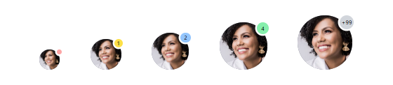
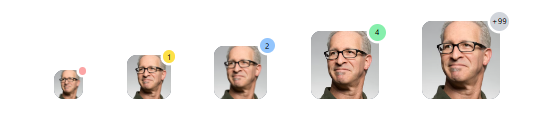
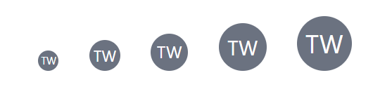
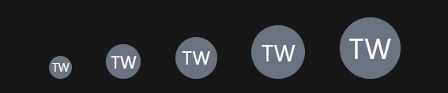
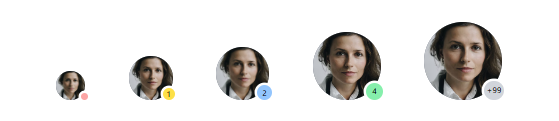

# Avatars

Use these avatar components to display user profile pictures and company logos individually or grouped in stacks.

## Usage

<br/>

### Avatar group stacked bottom to top

---
Light | Dark
---------- | ---------
 | 

>Code

```html
...
<tw-group className="-space-x-1">
  <tw-avatar>
    
  </tw-avatar>

  <tw-avatar>
    
  </tw-avatar>

  <tw-avatar>
    
  </tw-avatar>

  <tw-avatar>
    
  </tw-avatar>
</tw-group>
...
```

<br/>

### Circular avatars

---
Light | Dark
---------- | ---------
 | 

>Code

```html
<tw-avatar>
  
</tw-avatar>

<tw-avatar>
  
</tw-avatar>

<tw-avatar>
  
</tw-avatar>
...
```

> Avatar are fully rounded by default.

<br/>

### Circular avatars with top notification

---
Light | Dark
---------- | ---------
 | 

>Code

```html
<tw-avatar>
  
  <tw-tooltip className="size-1.5 bg-red-300" />
</tw-avatar>

<tw-avatar>
  
  <tw-tooltip className="size-2.5 bg-yellow-300">1</tw-tooltip>
</tw-avatar>

<tw-avatar>
  
  <tw-tooltip className="size-3 bg-blue-300">2</tw-tooltip>
</tw-avatar>
...
```

<br/>

### Rounded avatars

---
Light | Dark
---------- | ---------
 | 
>Code

```html
<tw-avatar>
  
</tw-avatar>

<tw-avatar>
  
</tw-avatar>

<tw-avatar>
  
</tw-avatar>
```

<br/>

### Rounded avatars with top notification

---
Light | Dark
---------- | ---------
 | 
>Code

```html
<tw-avatar>
  
  <tw-tooltip className="size-1.5 -top-0.5 bg-red-300" />
</tw-avatar>

<tw-avatar>
  
  <tw-tooltip className="size-2.5 -top-1 -right-1 bg-yellow-300">1</tw-tooltip>
</tw-avatar>

<tw-avatar>
  
  <tw-tooltip className="size-3 -top-1.5 -right-1.5 bg-blue-300">2</tw-tooltip>
</tw-avatar>
```

<br/>

### Circular avatars with placeholder icon

---
Light | Dark
---------- | ---------
 | 
>Code

```html
<tw-avatar className="size-6 text-gray-400">
  <svg xmlns="http://www.w3.org/2000/svg" viewBox="0 0 16 16" fill="currentColor">
    <path fill-rule="evenodd"
      d="M15 8A7 7 0 1 1 1 8a7 7 0 0 1 14 0Zm-5-2a2 2 0 1 1-4 0 2 2 0 0 1 4 0ZM8 9c-1.825 0-3.422.977-4.295 2.437A5.49 5.49 0 0 0 8 13.5a5.49 5.49 0 0 0 4.294-2.063A4.997 4.997 0 0 0 8 9Z"
      clip-rule="evenodd" />
  </svg>
</tw-avatar>

<tw-avatar className="size-9 text-gray-400">
  <svg xmlns="http://www.w3.org/2000/svg" viewBox="0 0 16 16" fill="currentColor">
    <path fill-rule="evenodd"
      d="M15 8A7 7 0 1 1 1 8a7 7 0 0 1 14 0Zm-5-2a2 2 0 1 1-4 0 2 2 0 0 1 4 0ZM8 9c-1.825 0-3.422.977-4.295 2.437A5.49 5.49 0 0 0 8 13.5a5.49 5.49 0 0 0 4.294-2.063A4.997 4.997 0 0 0 8 9Z"
      clip-rule="evenodd" />
  </svg>
</tw-avatar>

<tw-avatar className="size-11 text-gray-400">
  <svg xmlns="http://www.w3.org/2000/svg" viewBox="0 0 16 16" fill="currentColor">
    <path fill-rule="evenodd"
      d="M15 8A7 7 0 1 1 1 8a7 7 0 0 1 14 0Zm-5-2a2 2 0 1 1-4 0 2 2 0 0 1 4 0ZM8 9c-1.825 0-3.422.977-4.295 2.437A5.49 5.49 0 0 0 8 13.5a5.49 5.49 0 0 0 4.294-2.063A4.997 4.997 0 0 0 8 9Z"
      clip-rule="evenodd" />
  </svg>
</tw-avatar>
```

<br/>

### Circular avatars with placeholder initials

---
Light | Dark
---------- | ---------
 | 
>Code

```html
<tw-avatar className="size-6 text-xs text-white bg-gray-500">TW</tw-avatar>
<tw-avatar className="size-9 text-lg text-white bg-gray-500">TW</tw-avatar>
<tw-avatar className="size-11 text-xl text-white bg-gray-500">TW</tw-avatar>
```

<br/>

### Circular avatars with bottom notification

---
Light | Dark
---------- | ---------
 | 

>Code

```html
<tw-avatar>
  
  <tw-tooltip className="size-1.5 top- -bottom-0 bg-red-300" />
</tw-avatar>

<tw-avatar>
  
  <tw-tooltip className="size-2.5 top- -bottom-0 bg-yellow-300">1</tw-tooltip>
</tw-avatar>

<tw-avatar>
  
  <tw-tooltip className="size-3 top- -bottom-0 bg-blue-300">2</tw-tooltip>
</tw-avatar>
```

> `top-` is used here in `className` to remove the default value setted

<br/>

### Rounded avatars with bottom notification

---
Light | Dark
---------- | ---------
 | 

>Code

```html
<tw-avatar>
  
  <tw-tooltip className="size-1.5 top- -bottom-0 bg-red-300" />
</tw-avatar>

<tw-avatar>
  
  <tw-tooltip className="size-2.5 top- -bottom-0 bg-yellow-300">1</tw-tooltip>
</tw-avatar>

<tw-avatar>
  
  <tw-tooltip className="size-3 top- -bottom-0 bg-blue-300">2</tw-tooltip>
</tw-avatar>
```

<br/>

### Avatar group stacked top to bottom

---
Light | Dark
---------- | ---------
 | 

>Code

```html
...
<tw-group className="-space-x-1">
  <tw-avatar className="z-[4] hover:z-10 ring-2 ring-white">
    
  </tw-avatar>

  <tw-avatar className="z-[3] hover:z-10 ring-2 ring-white">
    
  </tw-avatar>

  <tw-avatar className="z-[2] hover:z-10 ring-2 ring-white">
    
  </tw-avatar>
  
  <tw-avatar className="z-[1] hover:z-10 ring-2 ring-white">
    
  </tw-avatar>
</tw-group>
...
```

<br/>

### Avatar With text

---
Light | Dark
---------- | ---------
 | 

>Code

```html
<tw-group className="gap-x-2">
  <tw-avatar>
    
  </tw-avatar>
  <span class="relative cursor-pointer text-nowrap group dark:text-white">
    <div class="absolute -top-1.5 text-md font-normal">Jane Smith</div>
    <a class="absolute bottom-0.5 text-xs opacity-70 group-hover:opacity-[1]">View profile</a>
  </span>
</tw-group>
```

## API

<br/>

### Avatar `<tw-avatar>`

---
Property  | Type        | Attribute   | Default | Description
----------|-------------|-------------|---------|------------
className | string      | `className` |  `''`   | The utilities class names to add/replace/remove.

<br/>

## Configurations

<br/>

Avatar config

---

```ts
export const AvatarConfig: AvatarConfig = {
  display: {
    type: 'flex',
    alignItem: 'items-center',
    justifyContent: 'justify-center'
  },
  position: 'relative',
  borderRadius: 'rounded-full'
}
```

---
