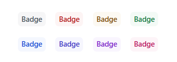
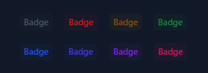
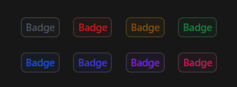
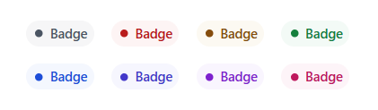
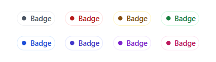
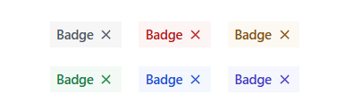
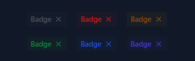
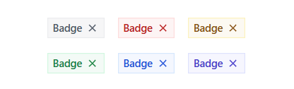
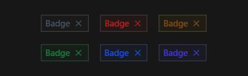

# Badges

Use these badges components to highlight important information, statuses, or counts in your application.

## Usage

<br/>

Flat badges

---
Light | Dark
---------- | ---------
 | 

>Code

```html
<tw-badge className="bg-gray-600 text-gray-600">Badge</tw-badge>
<tw-badge className="bg-red-600 text-red-700">Badge</tw-badge>
<tw-badge className="bg-yellow-600 text-yellow-800">Badge</tw-badge>
...
```

<br/>

With border

---
Light | Dark
---------- | ---------
 | 

>Code

```html
<tw-badge className="... ring-1 ring-gray-300">Badge</tw-badge>
<tw-badge className="... ring-1 ring-yellow-800">Badge</tw-badge>
<tw-badge className="... ring-1 ring-red-700">Badge</tw-badge>
...
```

> We simply added the ``ring-1`` class. It can be any of ``ring-*`` class (where ``*`` equals a supported number).

<br/>

Rounded badges

---
Light | Dark
---------- | ---------
 | 
 | 

>Code

```html
<tw-badge className="... rounded-full">
  <svg xmlns="http://www.w3.org/2000/svg" height="12px" viewBox="0 -960 960 960" width="12px" fill="currentColor">
    <path
      d="M480-200q-117 0-198.5-81.5T200-480q0-117 81.5-198.5T480-760q117 0 198.5 81.5T760-480q0 117-81.5 198.5T480-200Z" />
  </svg>
  Badge
</tw-badge>
...
```

<br/>

With action button

---
Light | Dark
---------- | ---------
 | 
 | 

>Code

```html
<!--With action-->
<tw-badge className="... rounded-none">
  Badge
  <button class="hover:bg-gray-600 hover:bg-opacity-20 size-[16px]">
    <svg xmlns="http://www.w3.org/2000/svg" viewBox="0 -960 960 960" fill="currentColor">
      <path d="m291-240-51-51 189-189-189-189 51-51 189 189 189-189 51 51-189 189 189 189-51 51-189-189-189 189Z" />
    </svg>
  </button>
</tw-badge>
...
<!--With action and border-->
<tw-badge className="... rounded-none">
  Badge
  <button class="hover:bg-indigo-600 hover:bg-opacity-20 size-[16px]">
    <svg xmlns="http://www.w3.org/2000/svg" viewBox="0 -960 960 960" fill="currentColor">
      <path d="m291-240-51-51 189-189-189-189 51-51 189 189 189-189 51 51-189 189 189 189-51 51-189-189-189 189Z" />
    </svg>
  </button>
</tw-badge>
...
```

## API

<br/>

### Badge `<tw-badge>`

---
Property  | Type        | Attribute   | Default | Description
----------|-------------|-------------|---------|------------
className | string      | `className` |  `''`   | The utilities class names to add/replace/remove.
padding | string      | `padding` |  `px-1.5 py-1`   | The padding size of the badge.

<br/>

## Configurations

<br/>

Dropdown config

---

```ts
export const BadgeConfigKey = 'BadgeConfigKey';

export const BadgeConfig: BadgeConfig = {
  display: {
    gap: 'gap-1',
    type: 'inline-flex',
    alignItem: 'items-center',
    justifyContent: 'justify-center',
  },
  fontWeight: 'font-medium',
  borderRadius: 'rounded-md'
}
```

---
