# Button Groups

Use these Tailwind CSS button group components to group buttons with other elements like dropdowns and checkboxes, for things like filtering options, pagination, or buttons with multiple actions.

<br/>

## Usage

<br/>

### With three buttons

---
Light | Dark
---------- | ---------
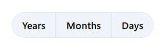 | 
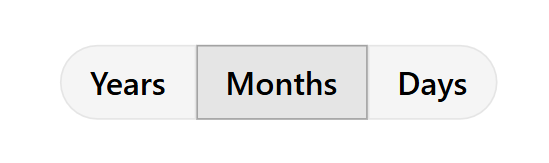 | 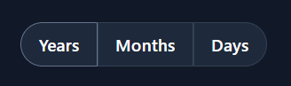

>Code

```html
<div>
  <tw-button variant="secondary" class="rounded-l-full">
    Years
  </tw-button>
  <tw-button variant="secondary" class="rounded-none">
    Months
  </tw-button>
  <tw-button variant="secondary" class="rounded-r-full">
    Days
  </tw-button>
</div>
```

<br/>

### Icon group with border

---
Light | Dark
---------- | ---------
 | 
 | 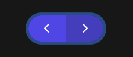

>Code

```html
<div class="ring-4 rounded-full">
  <tw-button class="rounded-l-full">
    <svg xmlns="http://www.w3.org/2000/svg" viewBox="0 0 20 20" fill="currentColor" class="size-6">
      <path fill-rule="evenodd"
        d="M11.78 5.22a.75.75 0 0 1 0 1.06L8.06 10l3.72 3.72a.75.75 0 1 1-1.06 1.06l-4.25-4.25a.75.75 0 0 1 0-1.06l4.25-4.25a.75.75 0 0 1 1.06 0Z"
        clip-rule="evenodd" />
    </svg>
  </tw-button>
  <tw-button class="rounded-r-full">
    <svg xmlns="http://www.w3.org/2000/svg" viewBox="0 0 20 20" fill="currentColor" class="size-6">
      <path fill-rule="evenodd"
        d="M8.22 5.22a.75.75 0 0 1 1.06 0l4.25 4.25a.75.75 0 0 1 0 1.06l-4.25 4.25a.75.75 0 0 1-1.06-1.06L11.94 10 8.22 6.28a.75.75 0 0 1 0-1.06Z"
        clip-rule="evenodd" />
    </svg>
  </tw-button>
</div>
```

<br/>

### With stats

---
Light | Dark
---------- | ---------
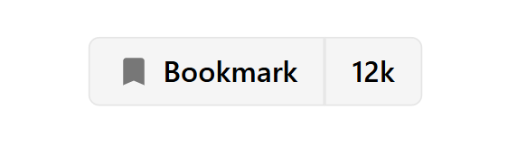 | 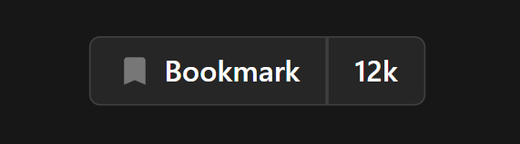
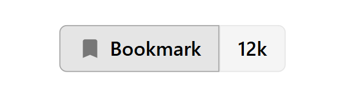 | 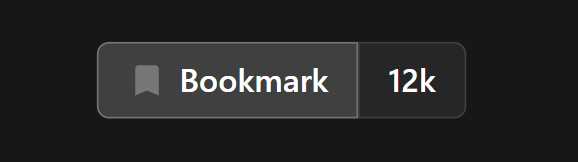

>Code

```html
<div>
  <tw-button variant="secondary" class="rounded-l-md">
    <svg xmlns="http://www.w3.org/2000/svg" height="20px" width="20px" fill="#777" viewBox="0 -960 960 960">
      <path d="M200-120v-640q0-33 23.5-56.5T280-840h400q33 0 56.5 23.5T760-760v640L480-240 200-120Z" />
    </svg>
    Bookmark
  </tw-button>
  <tw-button variant="secondary" class="rounded-r-md">
    12k
  </tw-button>
</div>
```

<br/>

### With dropdown

---
Light | Dark
---------- | ---------
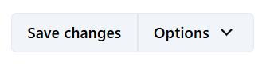 | 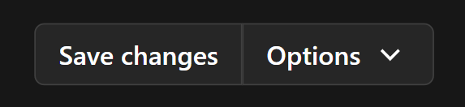
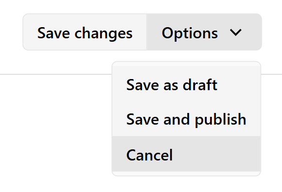 | 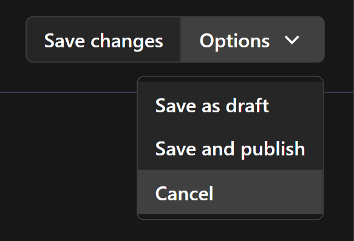

>Code

```html
<div>
  <tw-button variant="secondary" class="rounded-l-md">
    Save changes
  </tw-button>
  <tw-dropdown class="rounded-r-md">
    Options
    <svg xmlns="http://www.w3.org/2000/svg" height="24px" width="24px" fill="currentColor" viewBox="0 -960 960 960">
      <path d="M480-333 240-573l51-51 189 189 189-189 51 51-240 240Z" />
    </svg>
    <!-- item -->
    <tw-dropdown-content *ngFor="let item of items">
      {{ item }}
    </tw-dropdown-content>
  </tw-dropdown>
</div>
```
