# Buttons

Use these Tailwind CSS button components to surface the different actions someone can perform in your interface.

<br/>

Light | Dark
---------- | ---------
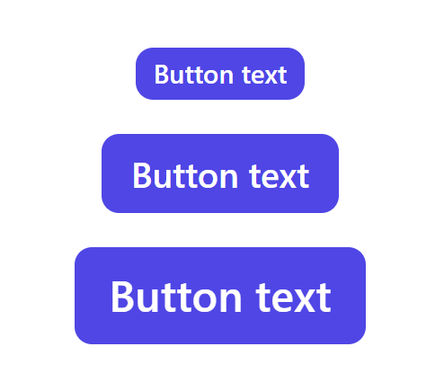 | 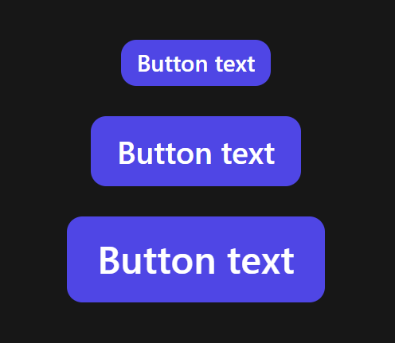
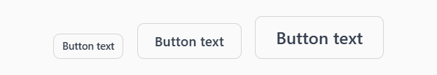 | 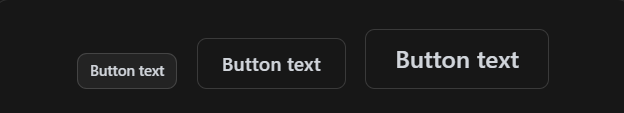
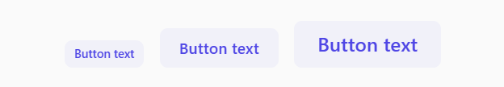 | 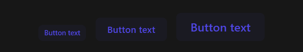
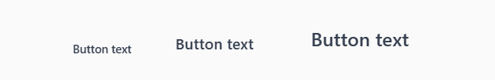 | 

>Code

```html
<tw-button>Button text</tw-button>
```

<br/>

### Icon buttons

Light | Dark
---------- | ---------
 | 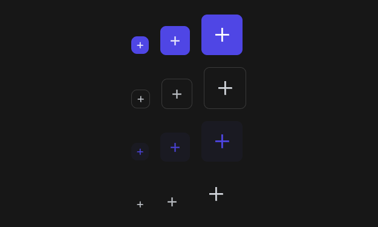

>Code

```html
<tw-button tw-icon className="rounded-lg">
  <svg class="size-6" xmlns="http://www.w3.org/2000/svg" viewBox="0 -960 960 960" fill="currentColor">
    <path d="M444-444H240v-72h204v-204h72v204h204v72H516v204h-72v-204Z" />
  </svg>
</tw-button>
```

<br/>

### FAB buttons

Light | Dark
---------- | ---------
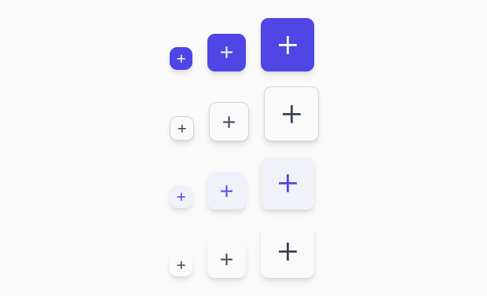 | 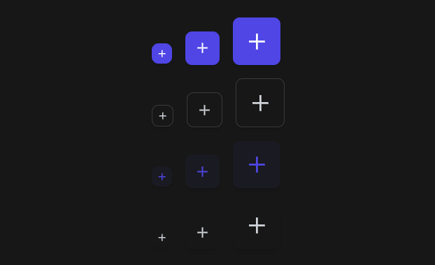

>Code

```html
<tw-button tw-fab className="rounded-lg">
  <svg class="size-6" xmlns="http://www.w3.org/2000/svg" viewBox="0 -960 960 960" fill="currentColor">
    <path d="M444-444H240v-72h204v-204h72v204h204v72H516v204h-72v-204Z" />
  </svg>
</tw-button>
```

<br/>

### Extended FAB

Light | Dark
---------- | ---------
 | 

>Code

```html
<tw-button tw-fab className="px-6 rounded-lg">
  <svg class="size-6" xmlns="http://www.w3.org/2000/svg" viewBox="0 -960 960 960" fill="currentColor">
    <path d="M444-444H240v-72h204v-204h72v204h204v72H516v204h-72v-204Z" />
  </svg>
  New task
</tw-button>
```

<br/>

## Rounded buttons

<br/>

### Primary buttons

Light | Dark
---------- | ---------
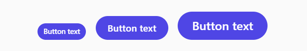 | 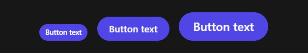

>Code

```html
<tw-button className="rounded-full"> Button text</tw-button>
```

<br/>

### Secondary buttons

Light | Dark
---------- | ---------
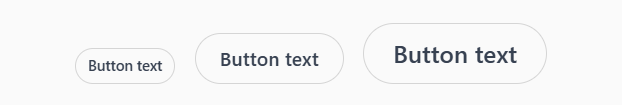 | 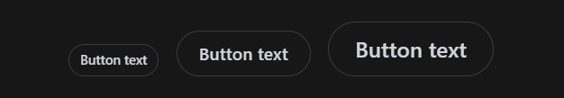

>Code

```html
<tw-button className="rounded-full" variant="secondary">Button text</tw-button>
```

<br/>

### Tonal buttons

Light | Dark
---------- | ---------
 | 

>Code

```html
<tw-button className="rounded-full" variant="tonal">Button text</tw-button>
```

<br/>

### Icon buttons

Light | Dark
---------- | ---------
 | 

>Code

```html
<tw-button tw-icon>
  <svg class="size-6" xmlns="http://www.w3.org/2000/svg" viewBox="0 -960 960 960" fill="currentColor">
    <path d="M444-444H240v-72h204v-204h72v204h204v72H516v204h-72v-204Z" />
  </svg>
</tw-button>
```

<br/>

### FAB buttons

Light | Dark
---------- | ---------
 | 

>Code

```html
<tw-button tw-fab>
  <svg class="size-6" xmlns="http://www.w3.org/2000/svg" viewBox="0 -960 960 960" fill="currentColor">
    <path d="M444-444H240v-72h204v-204h72v204h204v72H516v204h-72v-204Z" />
  </svg>
</tw-button>
```

<br/>

### Extended FAB

Light | Dark
---------- | ---------
 | 

>Code

```html
<tw-button tw-fab className="px-6">
  <svg class="size-6" xmlns="http://www.w3.org/2000/svg" viewBox="0 -960 960 960" fill="currentColor">
    <path d="M444-444H240v-72h204v-204h72v204h204v72H516v204h-72v-204Z" />
  </svg>
  New task
</tw-button>
```

<br/>

## Usage sample

### Buttons with leading icon

Light | Dark
---------- | ---------
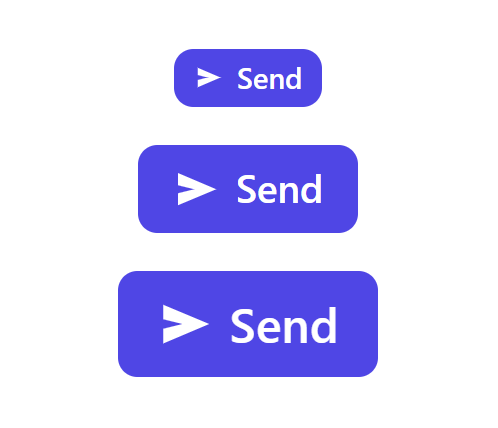 | 

>Code

```html
<tw-button>
  <svg class="size-5" xmlns="http://www.w3.org/2000/svg" viewBox="0 -960 960 960" fill="currentColor">
    <path d="M120-160v-240l320-80-320-80v-240l760 320-760 320Z" />
  </svg>
  Send
</tw-button>
```

<br/>

### Buttons with trailing icon

Light | Dark
---------- | ---------
 | 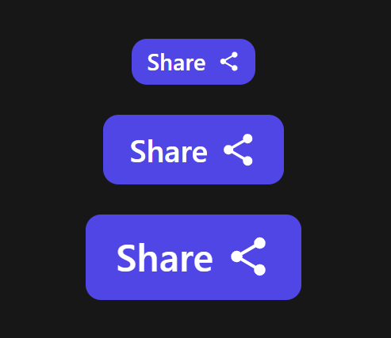

>Code

```html
<tw-button>
  Share
  <svg class="size-5" xmlns="http://www.w3.org/2000/svg" viewBox="0 -960 960 960" fill="currentColor">
    <path
      d="M720-80q-50 0-85-35t-35-85q0-7 1-14.5t3-13.5L322-392q-17 15-38 23.5t-44 8.5q-50 0-85-35t-35-85q0-50 35-85t85-35q23 0 44 8.5t38 23.5l282-164q-2-6-3-13.5t-1-14.5q0-50 35-85t85-35q50 0 85 35t35 85q0 50-35 85t-85 35q-23 0-44-8.5T638-672L356-508q2 6 3 13.5t1 14.5q0 7-1 14.5t-3 13.5l282 164q17-15 38-23.5t44-8.5q50 0 85 35t35 85q0 50-35 85t-85 35Z" />
  </svg>
</tw-button>
```

<br/>

## API

<br/>

### Button `<tw-button>`

Property  | Type        | Default | Description
----------|-------------|---------|------------
size      | SizeVariant |`md`  | The component size.
className | string      |  `''`   | Utility class names to add/replace/remove.
---

### Icon `[tw-icon]`

Property  | Type        | Default | Description
----------|-------------|---------|------------
className | string      |  `''`   | Utility class names to add/replace/remove.
---

### FAB & Extented FAB `[tw-fab]`

Property  | Type        | Default | Description
----------|-------------|---------|------------
className | string      |  `''`   | Utility class names to add/replace/remove.
---

<br/>

## Configuration

<br/>

```ts
/** Button variant */
export type ButtonVariant =
  | 'primary' // default variant
  | 'secondary'
  | 'tonal'
  | 'text'

/** Base button config */
export const ButtonBaseConfig: ButtonBaseConfig = {
  ...BaseConfig,
  textWrap: 'text-nowrap',
  overflow: 'overflow-hidden',
  userSelect: 'select-none'
}

/** Primary button config */
export const PrimaryButtonConfig: PrimaryButtonConfig = {
  ...ButtonBaseConfig,
  theme: {
    textColor: 'text-white',
    bgColor: 'bg-indigo-600',
    hover: {
      bgOpacity: 'hover:bg-opacity-80'
    }
  }
}

/** Secondary button config */
export const SecondaryButtonConfig: SecondaryButtonConfig = {
  ...ButtonBaseConfig,
  borderWidth: 'border',
  theme: {
    light: {
      bgColor: 'bg-black',
      textColor: 'text-gray-700',
      borderColor: 'border-black',
      bgOpacity: 'bg-opacity-0',
      borderOpacity: 'border-opacity-15',
      hover: {
        bgOpacity: 'hover:bg-opacity-5'
      },
      focus: {
        borderOpacity: 'focus:border-opacity-30'
      }
    },
    dark: {
      bgColor: 'dark:bg-white',
      textColor: 'dark:text-gray-300',
      borderColor: 'dark:border-white',
      bgOpacity: 'dark:bg-opacity-0',
      borderOpacity: 'dark:border-opacity-15',
      hover: {
        bgOpacity: 'dark:hover:bg-opacity-5'
      },
      focus: {
        borderOpacity: 'dark:focus:border-opacity-30'
      }
    }
  }
}

/** Tonal button config */
export const TonalButtonConfig: TonalButtonConfig = {
  ...ButtonBaseConfig,
  theme: {
    textColor: 'text-indigo-600',
    bgOpacity: 'bg-opacity-5',
    bgColor: 'bg-indigo-600',
    hover: {
      bgOpacity: 'hover:bg-opacity-10'
    }
  }
}


/** Text button config */
export const TextButtonConfig: TonalButtonConfig = {
  ...ButtonBaseConfig,
  theme: {
    light: {
      textColor: 'text-gray-700',
      hover: {
        textColor: 'hover:text-gray-950'
      }
    },
    dark: {
      textColor: 'dark:text-gray-300',
      hover: {
        textColor: 'dark:hover:text-gray-50'
      }
    }
  }
}


/** Button config key */
export const ButtonConfigKey = 'ButtonConfigKey';

/** Button config */
export type ButtonConfig = {
  primary: Partial<PrimaryButtonConfig>,
  secondary: Partial<SecondaryButtonConfig>,
  tonal: Partial<TonalButtonConfig>,
  text: Partial<TextButtonConfig>
}

export const ButtonConfig: ButtonConfig = {
  primary: PrimaryButtonConfig,
  secondary: SecondaryButtonConfig,
  tonal: TonalButtonConfig,
  text: TextButtonConfig
}
```
