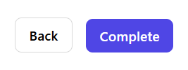
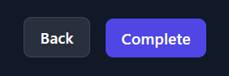
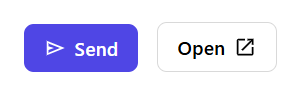
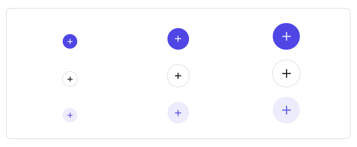
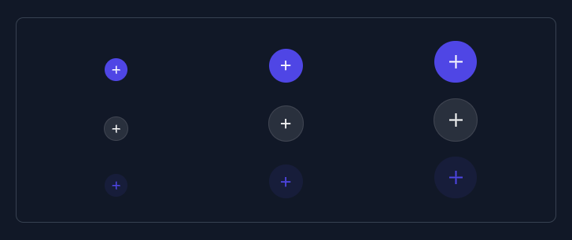

# Buttons

[Buttons](https://developer.mozilla.org/en-US/docs/Web/HTML/Element/button) help people initiate actions, from sending an email, to sharing a document, to liking a post.

<br/>

## Usage

A secondary button with the text "Back" next to a primary button with the text "Complete"

---
Light | Dark
---------- | ---------
 | 

```html
<tw-button variant="secondary">Back</tw-button>
<tw-button>Complete</tw-button>
```

## Icons

An icon may optionally be added to a button to help communicate the button's action and help draw attention.

---
Light | Dark
---------- | ---------
 | 

>Code sample

```html
<tw-button>
  <svg xmlns="http://www.w3.org/2000/svg" height="20px" viewBox="0 -960 960 960" width="20px" fill="currentColor"><path d="M144-192v-576l720 288-720 288Zm72-107 454-181-454-181v109l216 72-216 72v109Zm0 0v-362 362Z"/></svg>
  Send
</tw-button>
<tw-button variant="secondary">
  Open
  <svg xmlns="http://www.w3.org/2000/svg" height="20px" viewBox="0 -960 960 960" width="20px" fill="currentColor"><path d="M216-144q-29.7 0-50.85-21.15Q144-186.3 144-216v-528q0-29.7 21.15-50.85Q186.3-816 216-816h264v72H216v528h528v-264h72v264q0 29.7-21.15 50.85Q773.7-144 744-144H216Zm171-192-51-51 357-357H576v-72h240v240h-72v-117L387-336Z"/></svg>
</tw-button>
```

---
Light | Dark
---------- | ---------
 | 

>Code sample

```html
<tw-button className="rounded-full px-2 py-2">
  <svg xmlns="http://www.w3.org/2000/svg" height="20px" viewBox="0 -960 960 960" width="20px" fill="currentColor">
    <path d="M444-444H240v-72h204v-204h72v204h204v72H516v204h-72v-204Z" />
  </svg>
</tw-button>
<tw-button variant="secondary" className="rounded-full px-2 py-2">
  <svg xmlns="http://www.w3.org/2000/svg" height="20px" viewBox="0 -960 960 960" width="20px" fill="currentColor">
    <path d="M444-444H240v-72h204v-204h72v204h204v72H516v204h-72v-204Z" />
  </svg>
</tw-button>
<tw-button variant="soft" className="rounded-full px-2 py-2">
  <svg xmlns="http://www.w3.org/2000/svg" height="20px" viewBox="0 -960 960 960" width="20px" fill="currentColor">
    <path d="M444-444H240v-72h204v-204h72v204h204v72H516v204h-72v-204Z" />
  </svg>
</tw-button>
```

<br/>

## API

<br/>

### Button `<tw-button>`

---

Property  | Type        | Attribute   | Default | Description
----------|-------------|-------------|---------|------------
size      | SizeVariant | `size`    | `'md'`  | The component size.
className | string      | `className` |  `''`   | The list of classes to add or override in the component `style` property.
---

## Default configurations

<br/>

Primary config

---

```ts
export const PrimaryButtonConfigKey = 'PrimaryButtonConfigKey';

export const PrimaryButtonConfig: PrimaryButtonConfig = {
  ...ButtonBaseConfig,
  theme: {
    textColor: 'text-white',
    bgColor: 'bg-indigo-600',
    hover: {
      bgOpacity: 'hover:bg-opacity-80'
    }
  }
}
```

<br/>

Secondary config

---

```ts
export const SecondaryButtonConfigKey = 'SecondaryButtonConfigKey';

export const SecondaryButtonConfig: SecondaryButtonConfig = {
  ...ButtonBaseConfig,
  borderWidth: 'border',
  userSelect: "select-text",
  theme: {
    light: {
      textColor: 'text-black',
      bgColor: 'bg-neutral-100',
      borderColor: 'border-neutral-200',
      hover: {
        bgColor: 'hover:bg-neutral-200'
      },
      focus: {
        borderColor: 'focus:border-neutral-400'
      }
    },
    dark: {
      textColor: 'dark:text-white',
      bgColor: 'dark:bg-neutral-800',
      borderColor: 'dark:border-neutral-700',
      hover: {
        bgColor: 'dark:hover:bg-neutral-700'
      },
      focus: {
        borderColor: 'dark:focus:border-neutral-500'
      }
    }
  }
}
```

<br/>

Soft config

---

```ts
export const SoftButtonConfigKey = 'SoftButtonConfigKey';

export const SoftButtonConfig: SoftButtonConfig = {
  ...ButtonBaseConfig,
  theme: {
    textColor: 'text-indigo-600',
    bgOpacity: 'bg-opacity-10',
    bgColor: 'bg-indigo-600',
    hover: {
      bgOpacity: 'hover:bg-opacity-20'
    }
  }
}
```

<br/>

Base config

---

```ts
export const ButtonBaseConfig: ButtonBaseConfig = {
  ...BaseConfig,
  textWrap: 'text-nowrap',
  overflow: 'overflow-hidden',
  userSelect: 'select-none'
}
```

---
