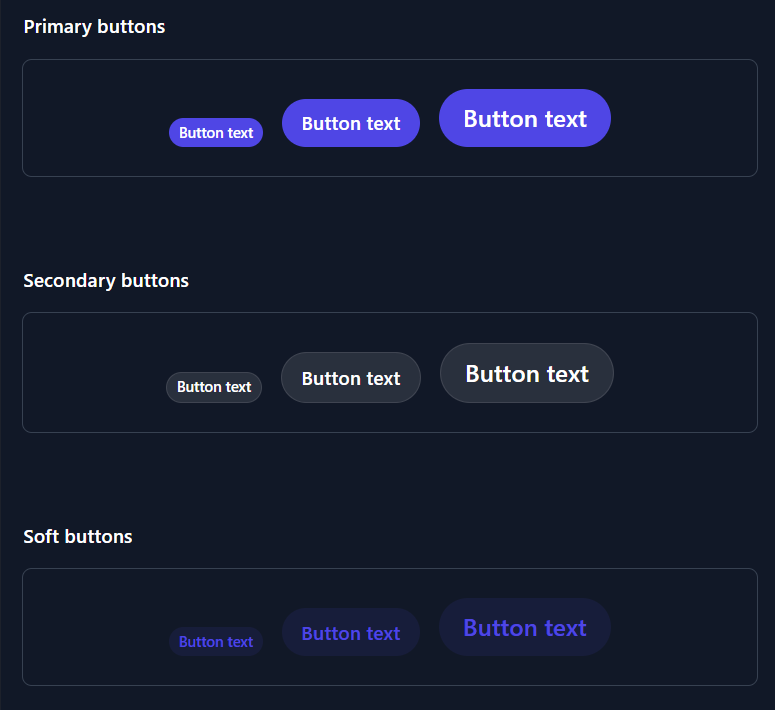

# Buttons

[Buttons](https://developer.mozilla.org/en-US/docs/Web/HTML/Element/button)<!-- {.external} --> help people initiate actions, from sending an email, to sharing a document, to liking a post.

[@ngx-twcss](https://www.npmjs.com/package/ngx-twcss) provide three types of buttons: primary, secondary and soft.

## Types

[@ngx-twcss](https://www.npmjs.com/package/ngx-twcss) provide three types of buttons:

1. **Primary**
2. **Secondary**
3. **Soft**


Light mode | Dark mode
---------- | ---------
 | 

## Usage

A secondary button with the text "Back" next to a primary button with the text "Complete"

Light mode | Dark mode
---------- | ---------
 | 

```html
<nxt-secondary-button>Back</nxt-secondary-button>
<nxt-primary-button>Complete</nxt-primary-button>
```

## Icons

An icon may optionally be added to a button to help communicate the button's action and help draw attention.

Light mode | Dark mode
---------- | ---------
 | 

```html
<nxt-primary-button>
  <svg xmlns="http://www.w3.org/2000/svg" height="20px" viewBox="0 -960 960 960" width="20px" fill="currentColor"><path d="M144-192v-576l720 288-720 288Zm72-107 454-181-454-181v109l216 72-216 72v109Zm0 0v-362 362Z"/></svg>
  Send
</nxt-primary-button>
<nxt-secondary-button>
  Open
  <svg xmlns="http://www.w3.org/2000/svg" height="20px" viewBox="0 -960 960 960" width="20px" fill="currentColor"><path d="M216-144q-29.7 0-50.85-21.15Q144-186.3 144-216v-528q0-29.7 21.15-50.85Q186.3-816 216-816h264v72H216v528h528v-264h72v264q0 29.7-21.15 50.85Q773.7-144 744-144H216Zm171-192-51-51 357-357H576v-72h240v240h-72v-117L387-336Z"/></svg>
</nxt-secondary-button>
```

Icons source: [Google Icons](https://fonts.google.com/icons)

## API

### PrimaryButtonComponent `<nxt-primary-button>`

Properties

Property  | Type        | Attribute   | Default | Description
----------|-------------|-------------|---------|------------
size      | SizeVariant | `[size]`    | `'md'`  | The component size.
className | string      | `className` |  `''`   | The list of space separated Tailwind CSS classes that adds (specific) or overrides (related) the component style.
style     | string[]    | `[style]`   |  `[]`   | The component style.

### SecondaryButtonComponent `<nxt-secondary-button>`

Properties

Property  | Type        | Attribute   | Default | Description
----------|-------------|-------------|---------|------------
size      | SizeVariant | `[size]`    | `'md'`  | The component size.
className | string      | `className` |  `''`   | The list of space separated Tailwind CSS classes that adds (specific) or overrides (related) the component style.
style     | string[]    | `[style]`   |  `[]`   | The component style.

### SoftButtonComponent `<nxt-soft-button>`

Properties


Property  | Type        | Attribute   | Default | Description
----------|-------------|-------------|---------|------------
size      | SizeVariant | `[size]`    | `'md'`  | The component size.
className | string      | `className` |  `''`   | The list of space separated Tailwind CSS classes that adds (specific) or overrides (related) the component style.
style     | string[]    | `[style]`   |  `[]`   | The component style.

## Default configurations

Primary button

```ts
export interface PrimaryButtonConfig extends Partial<BaseButtonConfig> {};

export const PrimaryButtonConfig: PrimaryButtonConfig = {
  ...BaseButtonConfig,
  theme: {
    textColor: 'text-white',
    bgColor: 'bg-indigo-600',
    modifier: {
      hover: {
        bgOpacity: 'hover:bg-opacity-90'
      }
    }
  }
}
```

Secondary button

```ts
export interface SecondaryButtonConfig extends Partial<BaseButtonConfig> {
  border: BorderWidth
}

export const SecondaryButtonConfig: SecondaryButtonConfig = {
  ...BaseButtonConfig,
  border: 'border',
  theme: {
    light: {
      textColor: 'text-black',
      bgColor: 'bg-black',
      bgOpacity: 'bg-opacity-0',
      borderColor: 'border-black',
      borderOpacity: 'border-opacity-15',
      modifier: {
        hover: {
          bgColor: 'hover:bg-gray-500',
          bgOpacity: 'hover:bg-opacity-5'
        },
        focus: {
          borderOpacity: 'focus:border-opacity-30'
        }
      }
    },
    dark: {
      textColor: 'dark:text-white',
      bgColor: 'dark:bg-white',
      bgOpacity: 'dark:bg-opacity-10',
      borderColor: 'dark:border-white',
      borderOpacity: 'dark:border-opacity-10',
      modifier: {
        hover: {
          bgColor: 'dark:hover:bg-white',
          bgOpacity: 'dark:hover:bg-opacity-20',
        },
        focus: {
          borderOpacity: 'dark:focus:border-opacity-20'
        }
      }
    }
  }
}
```

Soft button

```ts
export interface SoftButtonConfig extends Partial<BaseButtonConfig> { };

export const SoftButtonConfig: SoftButtonConfig = {
  ...BaseButtonConfig,
  theme: {
    textColor: 'text-indigo-600',
    bgColor: 'bg-indigo-600',
    bgOpacity: 'bg-opacity-10',
    modifier: {
      hover: {
        bgOpacity: 'hover:bg-opacity-20'
      }
    }
  }
}
```
