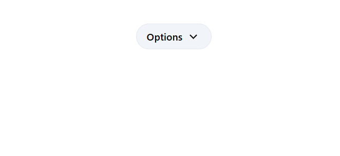
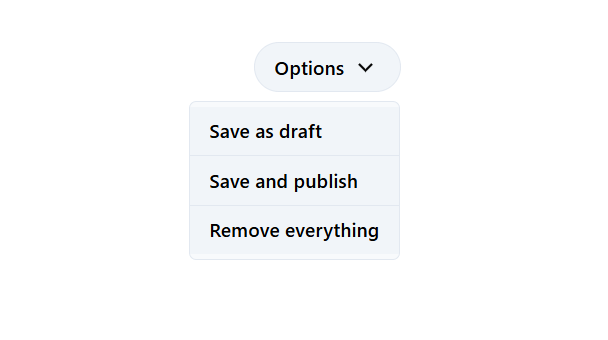
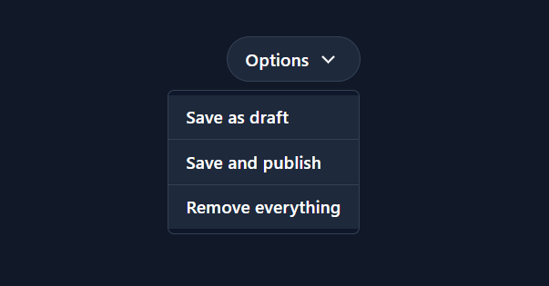
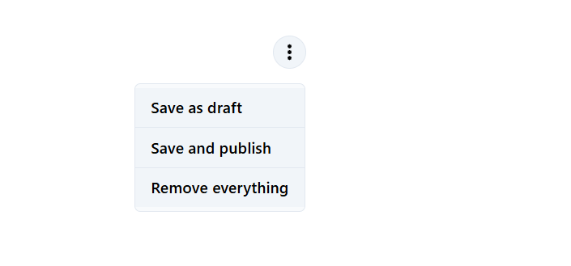
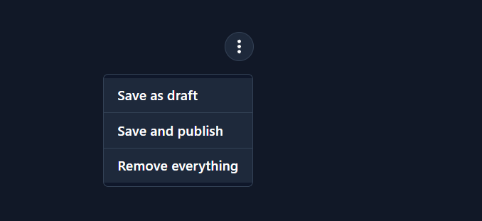

# Dropdowns

Use dropdown and popover components to create dropdown menus for action items and navigation, featuring section dividers, icons, and headers.

## Usage

<br/>

Dropdown with text and icon

---
Light | Dark
---------- | ---------
 | 
 | 

>Code

```html
<tw-dropdown className="rounded-full">
  Options
  <svg xmlns="http://www.w3.org/2000/svg" height="24px" width="24px" fill="currentColor" viewBox="0 -960 960 960">
    <path d="M480-333 240-573l51-51 189 189 189-189 51 51-240 240Z" />
  </svg>
  <tw-dropdown-item *ngFor="let item of items">
    {{ item }}
  </tw-dropdown-item>
</tw-dropdown>
```

<br/>

Dropdown with icon

---
Light | Dark
---------- | ---------
 | 
 | 

>Code

```html
<tw-dropdown className="rounded-full px-1 py-1">
  <svg xmlns="http://www.w3.org/2000/svg" height="24px" viewBox="0 -960 960 960" width="24px" fill="currentColor">
    <path
      d="M480-160q-33 0-56.5-23.5T400-240q0-33 23.5-56.5T480-320q33 0 56.5 23.5T560-240q0 33-23.5 56.5T480-160Zm0-240q-33 0-56.5-23.5T400-480q0-33 23.5-56.5T480-560q33 0 56.5 23.5T560-480q0 33-23.5 56.5T480-400Zm0-240q-33 0-56.5-23.5T400-720q0-33 23.5-56.5T480-800q33 0 56.5 23.5T560-720q0 33-23.5 56.5T480-640Z" />
  </svg>
  <tw-dropdown-item *ngFor="let item of items">
    {{ item }}
  </tw-dropdown-item>
</tw-dropdown>
```

## API

<br/>

### Dropdown `<tw-dropdown>`

---
Property  | Type        | Attribute   | Default | Description
----------|-------------|-------------|---------|------------
open | `boolean` | `[open]` | `false` | The dropdown state.
size      | ``SizeVariant`` | `size`    | `'md'`  | The component size.
className | ``string``      | `className` |  `''`   | The Tailwind CSS utility class names to add/replace/remove in the dropdown container style.
contentClassName | ``string``      | `contentClassName` |  `''`   | The Tailwind CSS utility class names to add/replace/remove in the dropdown content style.
contentPosition | `string` | `contentPosition` | `top-8 right-0` | The dropdown content position relative to the dropdown container.

<br/>

### DropdownItem `<tw-dropdown-item>`

---
Property  | Type        | Attribute   | Default | Description
----------|-------------|-------------|---------|------------
size      | SizeVariant | `size`    | `'md'`  | The component size.

<br/>

## Configurations

<br/>

Dropdown config

---

```ts
export const DropdownConfigKey = 'DropdownConfigKey';

export const DropdownConfig: DropdownConfig = {
  container: DropdownContainerConfig,
  content: DropdownContentConfig,
  item: DropdownItemConfig
}
```

<br/>

Dropdown container config

---

```ts
export const DropdownContainerConfig: DropdownContainerConfig = {
  ...DropdownBaseConfig,
  position: 'relative',
  extends: {
    cursor: 'hover:cursor-pointer'
  }
};
```

<br/>

Dropdown content config

---

```ts
export const DropdownContentConfig: DropdownContentConfig = {
  borderWidth: 'border',
  borderRadius: 'rounded-md',
  theme: {
    light: {
      bgColor: 'bg-neutral-50',
      borderColor: 'border-neutral-200'
    },
    dark: {
      bgColor: 'dark:bg-neutral-900',
      borderColor: 'dark:border-neutral-700'
    }
  },
  extends: {
    zIndex: 'z-50',
    marginTop: 'mt-4',
    paddingY: 'py-1',
    width: 'min-w-full'
  },
  position: {
    type: 'absolute'
  }
}
```

<br/>

Dropdown item config

---

```ts
export const DropdownItemConfig: DropdownItemConfig = {
  textAlign: 'text-start',
  width: 'w-full',
  borderRadius: 'rounded-none',
  borderWidth: 'border-0',
  display: {
    type: 'block'
  },
  theme: {
    light: {
      bgColor: 'bg-neutral-100',
      borderColor: 'border-neutral-200',
      hover: {
        bgColor: 'hover:bg-neutral-200'
      }
    },
    dark: {
      bgColor: 'dark:bg-neutral-800',
      borderColor: 'dark:border-neutral-700',
      hover: {
        bgColor: 'dark:hover:bg-neutral-700'
      }
    }
  }
}
```

<br/>

Dropdown base config

---

```ts
export const DropdownBaseConfig: DropdownBaseConfig = {
  textWrap: 'text-nowrap',
  userSelect: 'select-none',
  borderWidth: 'border',
  display: {
    type: 'inline-flex',
    justifyContent: 'justify-center',
    alignItem: 'items-center',
    gap: 'gap-1.5'
  },
  borderRadius: 'rounded-md',
  fontWeight: 'font-semibold',
  theme: {
    light: {
      textColor: 'text-black',
      bgColor: 'bg-neutral-100',
      borderColor: 'border-neutral-200',
      hover: {
        bgColor: 'hover:bg-neutral-200'
      },
      focus: {
        borderColor: 'focus:border-neutral-400'
      }
    },
    dark: {
      textColor: 'dark:text-white',
      bgColor: 'dark:bg-neutral-800',
      borderColor: 'dark:border-neutral-700',
      hover: {
        bgColor: 'dark:hover:bg-neutral-700'
      },
      focus: {
        borderColor: 'dark:focus:border-neutral-500'
      }
    }
  }
};
```
